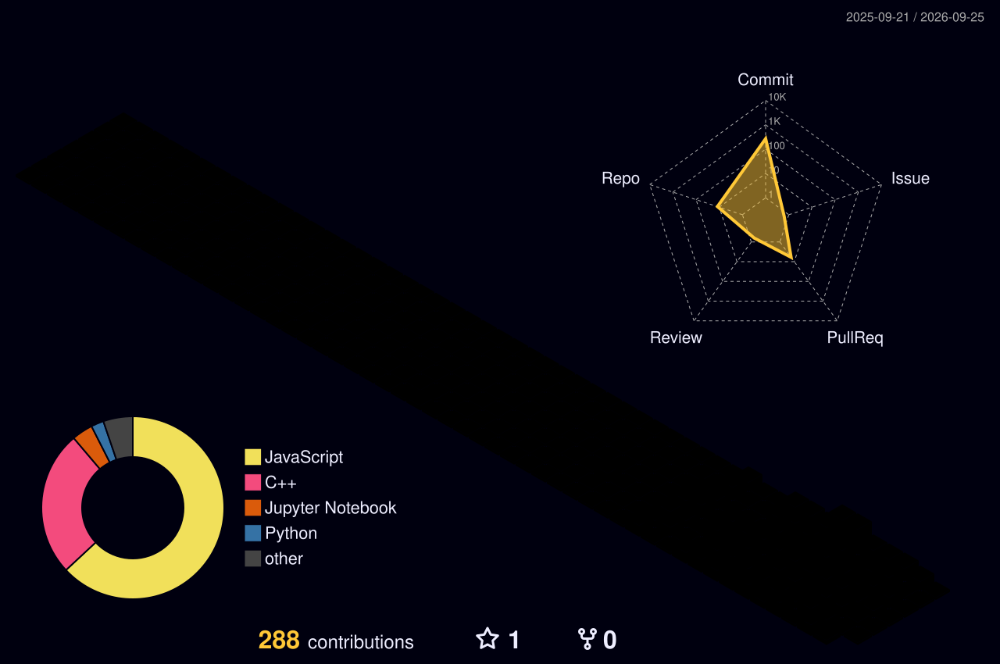

 

 

---

## 👨‍💻 About Me

<table>
<tr>
<td valign="top" width="58%">

### Hi, I'm Aditya! 👋

I'm a **B.Tech CSE (AI & ML)** student at **Shoolini University**, Himachal Pradesh — driven by a passion for building intelligent systems and full-stack applications that solve real-world problems.

- 🔭 **Currently Building:** AI-Powered Applications & Full-Stack Projects
- 🌱 **Currently Learning:** LLMs · Generative AI · React · Node.js
- 🎯 **Goal:** Land a Software / AI Engineering role by 2026
- 🤝 **Open to:** Internships · Collaborations · Open Source
- ⚡ **Philosophy:** Learn by Building — turning concepts into working apps

</td>
<td valign="top" width="42%" align="center">

</td>
</tr>
</table>

---

## 🛠️ Tech Stack

**💻 Languages**

 

**🎨 Frontend**

 

**⚙️ Backend & Databases**

 

**🔧 Tools & Development**

 

`Google Analytics` · `DaVinci Resolve`

---

## 🤖 AI / ML Expertise

| Domain | Level | Proficiency |
|:---|:---:|:---:|
| 🧠 Artificial Intelligence | Intermediate |  |
| ✨ Generative AI | Intermediate |  |
| 📊 Machine Learning | Beginner–Intermediate |  |
| 🏗️ AI Application Development | Intermediate |  |
| 🐍 Python | Intermediate |  |
| 🗄️ Databases (SQL & NoSQL) | Intermediate |  |
| 🌐 Full-Stack Development | Beginner–Intermediate |  |

---

## 🚀 Featured Projects

<table>
<tr>
<td width="50%" valign="top">

#### 🤖 AI Prototype Generator

> *Transform ideas into structured software prototypes*

An AI-powered application that uses large language models to transform user ideas into structured, functional software prototypes and starter implementations.

 

</td>
<td width="50%" valign="top">

#### 🧠 Jarvis AI

> *Personal AI assistant for intelligent task assistance*

A personal AI assistant capable of understanding and processing voice/text commands, providing intelligent AI-powered responses and task assistance.

 

</td>
</tr>
<tr>
<td width="50%" valign="top">

#### 🅿️ Smart Parking Management System

> *Digital solution for organized parking management*

A software solution improving parking management through digital tracking and organized parking-space allocation with real-time management capabilities.

 

</td>
<td width="50%" valign="top">

#### 🔜 More Projects Coming Soon...

> *Currently in development*

Currently working on exciting new projects in **AI, Full-Stack Development**, and **Developer Tools**. Follow to stay updated!

 

</td>
</tr>
</table>

---

## 🏅 Certifications

<table>
<tr>
<td align="center" width="33%">

**Introduction to AI in Azure** ✅

</td>
<td align="center" width="33%">

**Develop AI Apps & Agents on Azure** ✅

</td>
<td align="center" width="33%">

**Operationalize ML & Generative AI Solutions** ✅

</td>
</tr>
<tr>
<td align="center" colspan="3">

 

**Introduction to Generative AI – Art of the Possible** ✅

</td>
</tr>
</table>

---

## 📊 GitHub Analytics

 

---

## 🏆 GitHub Trophies

---

## 📈 Contribution Activity

---

## 🐍 Contribution Snake

<picture>
  <source media="(prefers-color-scheme: dark)" srcset="https://raw.githubusercontent.com/Aditya1112006/Aditya1112006/output/github-contribution-grid-snake-dark.svg"/>
  <source media="(prefers-color-scheme: light)" srcset="https://raw.githubusercontent.com/Aditya1112006/Aditya1112006/output/github-contribution-grid-snake.svg"/>
  
</picture>

---

## 🏙️ 3D Contribution Calendar

<picture>
  <source media="(prefers-color-scheme: dark)" srcset="./profile-3d-contrib/profile-night-rainbow.svg"/>
  <source media="(prefers-color-scheme: light)" srcset="./profile-3d-contrib/profile-gitblock.svg"/>
  
</picture>

> *Auto-generated daily — shows your entire contribution history as a 3D city skyline* 🏙️

---

## ⚡ Recent Activity

<!--START_SECTION:activity-->
<!--END_SECTION:activity-->

---

## 🤝 Let's Connect!

### I'm always open to interesting conversations, collaborations, and opportunities!

 

&nbsp;&nbsp;

&nbsp;&nbsp;

  

*"Programming isn't about what you know; it's about what you can figure out."*

**— Chris Pine**

---

